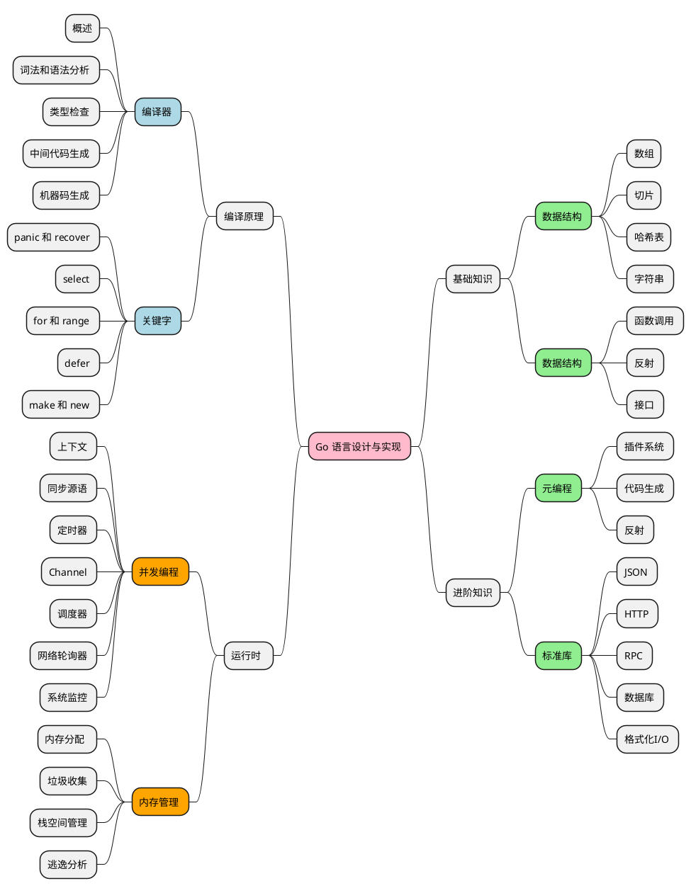

# Golang学习

## Golang mindmap

**Go命令和常用工具**

```shell
#GOPROXY
#Go1.11之后设置GOPROXY命令为：

export GOPROXY=https://goproxy.cn
#Go1.13之后GOPROXY默认值为https://proxy.golang.org，在国内是无法访问的，所以十分建议大家设置GOPROXY，这里我推荐使用goproxy.cn。

go env -w GOPROXY=https://goproxy.cn,direct

go install：编译并把编译好的结果移到$GOPATH/pkg或者$GOPATH/bin
go build ：编译（项目和文件）
#常用参数：
-o 指定输出的文件名，可以带上路径，例如 go build -o out main.go
-i 安装相应的包，编译+go install
-v 打印出来我们正在编译的包名
 
go get：安装第三方包
#常用命令：
-d 只下载不安装
-u 强制使用网络去更新包和它的依赖包
-v 显示执行的命令
#运行go get -u将会升级到最新的次要版本或者修订版本(x.y.z, z是修订版本号， y是次要版本号)
#运行go get -u=patch将会升级到最新的修订版本
#运行go get package@version将会升级到指定的版本号version
#如果下载所有依赖可以使用go mod download命令。
 
go clean：移除当前源码包和关联源码包里面编译生成的文件
 
go fmt：格式化代码
 
godoc：文档
godoc -http=:端口号 比如godoc -http=:8080然后打开127.0.0.1:8080可以在浏览器中查询pkg文档
godoc net/http：查看http包的文档
godoc -src fmt Printf：查看fmt.Printf的代码
 
go run 编译并运行Go程序

go mode 命令

go mod download    下载依赖的module到本地cache（默认为$GOPATH/pkg/mod目录）
go mod edit        编辑go.mod文件
go mod graph       打印模块依赖图
go mod init        初始化当前文件夹, 创建go.mod文件
go mod tidy        增加缺少的module，删除无用的module
go mod vendor      将依赖复制到vendor下
go mod verify      校验依赖
go mod why         解释为什么需要依赖

go list 命令
go list -m -f '{{if not .Indirect}}{{.Path}}{{end}}' all # 查看项目所有依赖包
```
## 第一部分 预备知识
### 第一章 准备工作
#### 1.1 调试源代码
1.1.1 编译源码
```shell
./src/make.bash
```

1.1.2 中间代码
```shell
GOSSAFUNC=main go build helloworld.go
# runtime
dumped SSA to /home/henry/GitHub/go-swimming/src/appengine/go11x/helloworld/ssa.html
# command-line-arguments
dumped SSA to ./ssa.html
```

1.1.3 小结
> 如果我们想要研究源代码的详细编译优化过程，可以使用上面提到的 SSA 中间代码深入研究 Go 语言的中间代码以及编译优化的方式，不过只要我们想了解 Go 语言的实现原理，阅读源代码是绕不开的过程。

### 第二章 编译原理

#### 2.1 编译过程

> Go 的编译器在逻辑上可以被分成四个阶段：词法与语法分析、类型检查和 AST 转换、通用 SSA 生成和最后的机器代码生成。


#### 2.2 词法分析和语法分析
#### 2.3 类型检查
#### 2.4 中间代码生成
#### 2.5 机器码生成

## References

- [Go 语言设计与实现](https://draven.co/golang/)