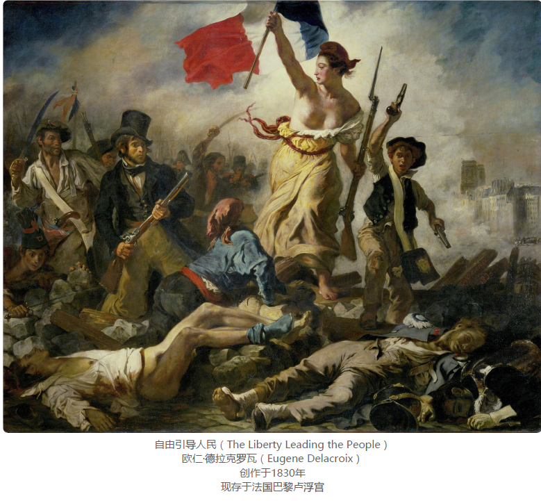
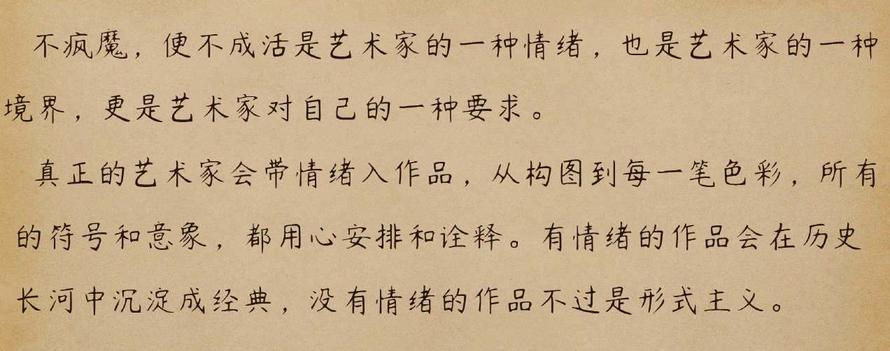
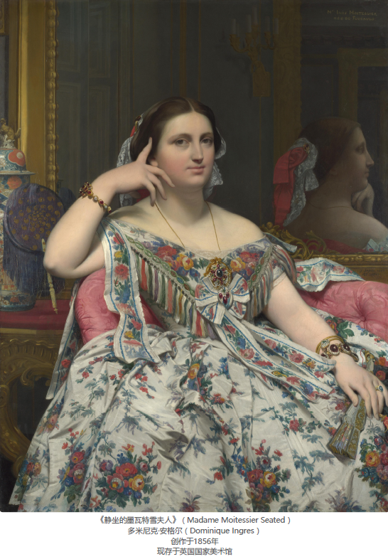

# 如何看懂一幅画

课程作者：

> 我叫罗桂霞，是意大利罗马美术学院的讲师、意大利 Amelia 当代艺术节创办人、凤凰中意文化交流协会会长，精通绘画、雕塑、版画和展览策划等。

## 00丨开篇词丨先看懂一幅画，再去看这个世界

那什么才是美的东西呢？我们欣赏什么才能培养审美呢？

**这些艺术品就是审美的方向标。**

学会思考何为美的东西，开始有审美意识，提升自己的审美修养。

油画是如何产生的？古希腊为什么要追求黄金比例？文艺复兴究竟在复兴什么？印象派的作品为什么总是给人飘忽不定的感觉？

我会从鉴赏油画的 9 个核心维度出发，教你如何去欣赏一幅油画。这 9 个维度分别是：色彩、光、构图、结构变形、抽象、艺术符号、艺术情绪、视觉传达、艺术语言，它们彼此之间相互联系，在难度和深度上也是层层递进的关系。

油画史上三位赫赫有名的艺术家：**戈雅、莫奈和毕加索**

海格德尔曾说过，**人应该先学会体验这个世界，然后才能诗意地言说这个世界**。

我们再一起回来看你的认知和思维方式是否有变化？你的期待是否实现了？

## 01 | 历史与流派：关于油画，你必须了解的事儿

> 万物有始有终，只要人类文明存在一天，艺术就永远不会消亡。

波利克莱塔斯提出的 1：7 人体黄金比例.

古希腊雕像群像

从乔托身上，我们能看到文艺复兴主要是复兴两点：

- 人文精神的复兴：画家的视角开始从神转向了人，是人权复兴的开始；

- 技法的复兴：开始恢复古希腊和古罗马时期对绘画技法的追求。

讲到文艺复兴，就避不开文艺三杰：**达芬奇（1452-1519 年）、米开朗基罗（1475-1564 年）和拉斐尔（1483-1520 年）**。达芬奇的绘画最有名的是《最后的晚餐》和《蒙娜丽莎》；米开朗基罗的绘画以西斯廷礼拜堂的壁画为代表；拉斐尔绘画的代表作包括《西斯廷圣母》《雅典学院》等。

不过在十九世纪末，许多曾受到印象主义鼓舞的艺术家开始反对印象派，他们觉得刻意追求光色太片面，色彩应该作为手段自觉运用，而且一个作品应该抒发艺术家的自我感受和主观感情，于是，后印象派从此诞生。代表画家有梵高（1853-1890 年）、塞尚（1839-1906 年）和高更（1848-1903 年）。

同样喜欢追求艺术家个人感受的画派：**表现主义**，也诞生了，他们用绘画来反抗这个世界。然后，毕加索（1881-1973 年）和布拉克（1882-1963 年）发展了立体主义，开始破坏一切自然形体，融入了更多的主观意识。

远古时期，我们敬畏自然和神明，那时的意识是超自我意识的；到了古希腊和罗马时期，回归到了追求现实的集体意识表达；再经历了中世纪神权左右意识的时代，来到了文艺复兴时期自我意识的解放，经历了印象派的自我意识探索，到了如今纯自我意识的表达。

> In ancient times, we were in awe of nature and God, and our consciousness was super self-conscious. In the period of ancient Greece and Rome, it returned to the collective consciousness of pursuing reality. Then it went through the age of theocracy controlling consciousness in the Middle Ages, came to the liberation of self-consciousness in the Renaissance, experienced the exploration of self-consciousness in the Impressionism, and came to the expression of pure self-consciousness.

## 02 | 油画名词小清单：如何正确欣赏油画？

我分成了三个部分，分别是**色彩篇、画面篇和宗教篇**。

我们常用来分析画面里的色彩的词有：**纯度、色相、色调、明度和暗度**。

**色相**，指的就是相同色系，比如我们看到香蕉是黄色的，看到苹果是红色的。

**色调**指的就是当你一眼看过去时，**画面物体的大部分颜色**。

**明度和暗度都是指颜色的亮度**，但是它们是一对相反的概念。

**纯度**指的是一个颜色和其他颜色在一起勾兑的比例。一种颜色
里，掺杂的其他颜色越少，纯度就越高。

**画面篇**

画面就是我们看一幅画时，看到的除了颜色以外最直观的
东西。

**构图、笔触、线条和色块以及肌理**。

**构图**就是指画面中每个物体的位置是如何安排的。在油画
里，我们常说的构图法有**透视、黄金分割点和垂直构图**等。

透视分为 4 种，有定点透视（单点透视法）、散点透视、空
气透视和隐没透视。

**定点透视**。它是一种把立体三维空间的形象表现在二维平面上的绘画方法，使观看的人对平面的画有立体感。

**散点透视**就是在同一个画面中可以有多个焦点，如同一边走一边看，每一段都可以有一个焦点，视域范围可以无限扩大，因此可以画非常长的长卷或立轴画。

**空气透视法**一般用颜色的鲜明度表现物体的远近，也就是说，近处的物体色彩鲜明，远处
的物体色彩模糊，失去了原来的颜色，一般就用淡蓝色代替。

**隐没透视法**一般用物体清晰度来表现物体的远近，所谓“远山无皴，远水无波，远树无
枝，远人无目”。

笔触就是绘画时，颜色在画面留下的痕迹。

**肌理**就是为了画面效果，做的一种特殊处理。

我们的态度一定要正确，何为正确的态度呢？就是我们可以不接受作品的画面感，也可以欣赏不了作品，但是，不管是对艺术家还是对作品，态度一定要尊重，要认真地面对在你面前的作品。

## 03 | 梵高的画到底好在哪里？

他画的向日葵就像是一个跳动的心脏，无论是枯萎盛开的向日葵，还是在花瓶里的向日葵，向日葵的黄色都是那么的浓郁，就像他，即使被生活磨平很多棱角，也要追随阳光的色彩。

> 当我画一个太阳，我希望人们感觉它在以惊人的速度旋转，正在发出骇人的光热巨浪。
> 
> 当我画一片麦田，我希望人们感觉到麦子正朝着它们最后的成熟和绽放努力。
> 
> …
> 
> 如果生活中不再有某种无限的、深刻的、真实的东西，我将不再眷恋人间。

蓝色的色调压抑而又抑郁，但是那颗近乎于黄色的月亮，就像他的梦，虽然被悲伤包围着，却依然散发着光亮。扭曲的丝柏树，马上就要冲破天空，就如他的处境。

**当一个人成功的时候，他所有的举动都可以被解释成一个奇迹；可如果他不成功的话，他就会被大家叫作疯子。**

**当你感受到他在画面里通过色彩与笔触倾注了他对艺术的爱、虔诚与执着，看他的每一幅画就会不自觉地难受，被他注入到作品里的情绪所影响。**

梵高的画到底好在哪里？我们从《星夜》和《向日葵》入手，研究了梵高是如何高级地使用相同色相和互补的颜色，同时，还欣赏了一幅高更的画。

不只油画里需要色彩，我们的生活也需要色彩。

情感的共鸣不仅可以来自于眼前人，还可以来自于遥远的时空。有时候，按照社会规则去生活其实很容易，真正难的是如何突破既定的规则、对抗别人的成见和坚守自己的本心。

> Color is not only needed in oil painting, but also in our life. The emotional resonance of color can come not only from people in front of us, but also from distant time and space. Sometimes, it is easy to live according to social rules.

但也因为这样，循规蹈矩的人会活成芸芸众生，打破规则和循环的人才会被后来人称为英雄。这场旅行的第一站，我献给我最爱的梵高，也希望今天这一讲，成为你平凡英雄梦想的起点。

> But it is also because of this that those who follow the rules will become ordinary beings, and those who break the rules and cycles will be called heroes by later generations. This is the first stop of this journey. I dedicate this lecture to my favorite Van Gogh, and I hope that this lecture will be the starting point of your ordinary heroic dreams.

## 04 | 为什么戴珍珠耳环的少女比蒙娜丽莎更灵动？

荷兰画家维米尔（1632-1675）的名画《戴珍珠耳环的少女》。

《戴珍珠耳环的少女》（The Girl with a Pearl Earring）
约翰内斯·维米尔（Johannes Vermeer）
创作于1665年
现存于荷兰海牙莫瑞泰斯皇家美术馆

《杜普医生的解剖课》（The Anatomy Lesson of Dr. Nicolaes Tulp）
伦勃朗（Rembrandt）
创作于1632年
现存于海牙莫里斯皇家绘画陈列馆

《圣经·马太福音》中说：“在黑暗中开黎明。”一语道破了光在这个世界中的位置，它是
一切万物得以显现并且被赋予生命的神奇物质。

## 05 ｜《自由引导人民》超燃的秘密是什么？

## 06 | 名画《呐喊》是怎么变成表情包的？

我会通过**蒙克**、**莫迪利亚尼**和**波提切利**三位大师的代表作，带你分析什么是结构变形，以及大师们是如何运用结构变形手法来表达思想的。

代表欲望的颜色，衬托着女人变形的身体，虽然用了一种极尽夸张的方式表现这个女人的美，但却让你感觉很真实。

艺术品有记录历史的功能，比如，我们上一讲的《自由引导人民》，我们能感受到法国七月革命的氛围。但是，**艺术品的主要作用并不只是记录历史，而是表达，表达艺术家的思想、情感和观点。**

因为画面里所表达的这个思想感情不只是艺术家个人的。能被称为艺术品，它所表达的东西就一定要能产生共鸣。也就是说，画面表达的东西要**从艺术家的个性上升到普遍性、共通性，甚至上升到普世价值。**

## 07 | 抽象画究竟在画什么？

在学习了油画的色彩、光、构图和结构变形后，我们终于还是来到了“抽象”这一站，“抽象”是我们欣赏油画中最难啃的一个瓜，也是最难爬的一座山。

**什么是抽象**

> 抽象是从众多的事物中抽取出共同的、本质性的特征。
> ——抽象的概念

是不是觉得这个定义也挺抽象的？是的，定义、概念和推理等思维形式，本身就是抽象的，因为它们就是从很多的具象里，提炼出来的一种本质性的规律。

抽象画并不是在画无中生有的东西，而是抽象派的画家在对具体
实物概括和提炼的过程中，所使用的抽象思维等级更高。

其实这样做是因为每一幅抽象画背后，都是艺术家的无数次思考和高度提炼与概括，我们是无法真正读懂的。

第一，抽象画的创作意图一般可分为传达情绪（以负面情绪主）、人生反思、哲学思考、激发想象和视觉传达这五种。
第二，我们要看作品的名字是什么、要看艺术家是处于哪个创作时期、要看创作年代的时代背景是什么等等信息。

也许每个艺术家都能画出康定斯基或者蒙特里安的作品，但是在他们之前，并没有人那么做。**是他们的艺术思想高度创造了这些艺术形式，而不是这些形式本身有多么不同**。

**每个画抽象艺术的艺术家，都曾画过大量的写实**。

我们还欣赏了两位抽象艺术大师，康定斯基和蒙德里安的作品。我们知道了，欣赏艺术不能只追求读懂，更要学会去感受艺术家的内心世界和思想感情。我们不仅要看一件艺术品的技法水平，还要去学会理解作品背后的核心。

## 08 | 油画圈里有哪些经久不衰的“梗”？

人类试图建一个大的通天塔，想要直达天庭与神平起平坐。不过这一切被上帝发现了，上帝生气了，就悄悄进入人间，把大家变成了不同语言的群体。

你了解的多了、积累多了，就会形成视觉上的记忆习惯。你看到了一幅画可能立马就会想到，这个画家画的是什么故事、用了什么象征、原来他是在致敬谁、引用什么、表达什么。

跨度和难度可能都有点大，要是觉得生涩难懂，就多看几遍，和前面内容结合起来。既然想做艺术圈的卧底，苦头还是要吃一些的。

## 09 | 如何在一幅画里观察艺术家的情绪？

下一次如果别人跟你说《创造亚当》这幅画很好看，你可以问问他，究竟是上帝创造了亚当，还是亚当创造了上帝呢？

**第一招：识别艺术符号**

**第二招：寻找关键细节**

**第三招：对比不同作品**

**第四招：分辨真情假意**

**第五招：查找社会背景**

第一招：识别艺术符号。通过分析毕加索的《格尔尼卡》，我们学会了有时候“名人名言”套用的得当，自己几乎都不用怎么说话就可以表达明白，而且还思想到位。
第二招：寻找关键细节。在米开朗基罗的《创造亚当》中，我们通过细节的推敲，发现这不只是一幅简单的宗教画，它含有人与神之间的辩证思维关系，到底是人类的意识形态创造了神，还是神创造了人？
第三招：对比不同作品。我们发现往往一个时代的另类，才是真相的发现者，如我们之前分析过的卡拉瓦乔与梵高。
第四招：分辨真情假意。我通过分析两幅弗朗西斯卡的作品，再一次让你也见识到了他的厉害，也间接看出了艺术家的傲气与顽皮性，把明扬暗讽的小把戏玩的得心应手。
第五招：查找社会背景。最后，我通过路易·大卫的《马拉之死》让你看出艺术家主观情绪对画面的影响力还是很大的，甚至可以起到误导事实的效果。

## 10 | 你知道最早的平面广告是什么吗？

如果说，艺术符号是画家想要传达的内容，艺术情绪是画家想通过这个内容给我们传达的意图或者目的，那除了内容和目的，我们还应该关注什么？其实，我们还应该关注的就是画家的传达方式，也就是说，画家在安排内容时是用了什么样的方式，他又是如何通过这种方式来实现他的意图的？

图像：色彩、构图
故事：内容、情节
技法：形式、技巧

基督教之所以千年不衰，信徒遍布全球各地，就是因为这些图像千年不变地在给他们传递着一个信息：神是存在的，就如我画的；神无处不在，会显现神迹；神是来拯救我们的；神就像我们一样会痛苦，像我们一样受过磨难，所以他才能拯救我们于水火之中。

我们经常开玩笑说，千万别让艺术家失业，因为我们脑洞太大了，很容易做出惊天动地的事情。想当年希特勒就是个失业的艺术生，结果他就发动了第二次世界大战，再比如我，跑到 IT 圈开艺课。

## 11 | 什么样的模仿才是高级的模仿？

艺术语言可以简单理解为一位画家在创作时，他用了什么材料和媒介，按照什么样的法则，用怎样的手段和方法表现了怎样的作品。

这个人就是安格尔（1780-1867 年），安格尔十分擅长画女性肖像画。他笔下的女性，就像加了磨皮和美颜的滤镜，十分的优雅和自然。

![The Source](data:image/jpeg;base64,/9j/4AAQSkZJRgABAQAAAQABAAD/2wCEAAwICRYVExcWFRYXFxgaHRofGhoXFxcXFxcdHx0gHx0dHR0iKDYtIiUzJh0dLkIuMzg7Pj8+IStFS0U9SjY9PjsBDA0NEhASHRISHTslHSU7Oz07Ozs9Ozs7Ozs7Oz09Oz09Ozs7Oz07O0c9PUc7RztHOztHOzs9PTs7Ozs7PTs7O//AABEIASwAlgMBEQACEQEDEQH/xAAbAAACAwEBAQAAAAAAAAAAAAADBAECBQYAB//EADcQAAIBAwIEBAQFAwMFAAAAAAABAgMRIQQxBRJBcSJRYYEGE7HBIzJCkaHR4fAUJPEVNFKSsv/EABgBAAMBAQAAAAAAAAAAAAAAAAABAgME/8QAIREBAQACAwEBAQADAQAAAAAAAAECESExQRIDUSIyYRP/2gAMAwEAAhEDEQA/AOJciTRFsQSm29wAstsXEanzWnux6JaOol5/yw0NrczfV+4g9NtLcCRd2AK/Nava49Gn522WIKVKr83+44FHXl5seg981+bDQTTqNvcRiu7W4gDVutrjgUu/N/uMhIVH5gHnuIPIAMo2QqYcpsei2lbCCsXZlEI6t1ZXFoKSn7ho0zlgIQLlgo08wgrIA8gCWgC9CORUzPyxGW1D6DhUFIZLJgBbZACU6a6iA3KiVF62GVEquWADqeCfDdOVJTq3lKSva7SiumxllnfFzH+nZ8A09sRt7v8AqT91XzGZrfh6KzC++19ipnS+Gb/0STdk7d0V9l8oq8AqJXU4O3TKH/6QfFZtSjKMuWSs/UvaVbAS0QCWAWo7i2DjRKiFaNm83KlIO4yWaEB77DAkWILyeCVF5yvhlJVhG7Ch9J0i8C7HLW+iPFNYqKTZUmyvDGq8bviOWV8l9Flrqk5Wwh6kLYVSvUT/ADfusDkgux3rKU4qNWPu/wCoas6G5Sn+iozmowqvO143/krd/idRmTTTa2ZaXlLzAD0Ik04bnF8rEbNrb73KhBMZLpiAjYwJRkID1diTLMZIW/YZvovC5c0I9kctbRlfGGmbpXX6Xf8AqX+V5Tn053hFBzmor3b2RrndROLsKHCaFlePisldSkr+uGYfVa6IcU4PBp/LlZrpfmX8lY5Jsc1W+Z+WV97LybRtx2zalHTpKPKldWe3VephcuW0x4J67h0pJPHMsXWLr19TTHOIywrKlBxdpJp+prvfTM1Q6Eg70ZBk6+nvnyKhEZepRJQwJygDFNWEHqlSy/qIwG7jJDQw774eqp0odkcubeHOK0FOnJPqicbo64jhWp+S5q15czWfTB0ZTbPG6b2g1tWtGUZR5Ha8X5r3M7jIqXYmh4ZUjJynNuPRf5uFs8OT+kOIQg52xzKV7de4b4LQkYmbRWSAFdTTurNXXorl41NjPqRStZNL1VjWMqPF4ESADN1cGmXCBKIykAEiSaKlNtYDYDdHKDY0q0MnT/C1d8lvJmH6TltjeHR1J3RnFOKjJUtVPnj4ZNtXWHnde9zfvHhnO+W5qdTywjOmouz2b5VZkT/rSw1S1d4WvdrfDiva4tGwJ1k60n7Ds4T6fp7Ga1+S4jCqUxykQ1UN0aY1FhSLwasRIrAjJ6rTtyxnA5SpWcLOxUIwojAlNEU144EakkABqFQnRfC8ly263Zl+nbTHp1appoxWyfiHgyqUY8llOOU++6Lwz1eUZRjShOglGvG8Xa0llf2ZffRy/wBTW4pDl5aSbb6scx/oubHpVLVHfzLynCMby2aFQwraU9SqRSu/2J0Nl6+ovsrIYZOtrmuMRaDS2NKyHjsTQmIjIa63NsVCqUtiiFpIimma+4Qw5DAMiibHwvK1Rrpgy/ReDuabVjnaCOF0LYKVtKnFxklKPk1cqVLNqcEpQvKMUv5NPu0vlx2toShVbaaTeDaXcR1TFDVWIuLSUdaq/Um4ntoaeKkjNWyHEtBfK6fyaYZaRliWglsa7ZaXiKhMVkSi2qoczvfA5SUgiqS9PqTTS+oBVoYBmioTb+FIeKb7fcz/AEXg7JVNkc6zUVgigOaGQbgVKbC43pFJNtbLHp6ly6LXDkNVR5Hjb+Ub43bOlnV/crQ20+G65pNyxYyzw54aY5FNXrJ1W7tpeS+5eOMiLlsGMXvsUlqUmRTWsSaZxAicVhF0JirCCfMAoMKNDJvfDEbc3cy/ReDoqdS08+RnYs7pdS25J25cWZFhr/MVwIaME0TDZuvVk2+hpily+r0fz6UqsF1ful1RrL80ry5irTtKzN5WdH5Xy4FRFYIYavD9NzLHu/szPKqg04pNxS238rry9hToqqkSFZjBVbFGjo7gSEAVbGEDJu/DD/N3Rl+i8G9qaDkrx3M9r0BQVZOzi/sHAauiTX5iaB/mpXFoymorRaaexUhFNBCPybRXhTkl02ZVJx/HdB8uo36/XY2wviMoUosuoaHCox+a1NLzV+6+9heGnX138yap+GDbvbFxaEqmgdp+6CgWXp5kGU1eps7LdbjkJWDwOmrLYIFhBSaKhIsMNX4dqWnJdiM14Ox08bo560MxiSHluMgNfSbWGPGhxXFuIyhJw2ZvjjvlNunR8Kf4Ebf+KIvYjI+JoNwulfK+peHZZENHouSPNL8z6eSHllspCdSf4qaLnSaPWV89hBWhh+6GBW8X9CPTIaucZNNe+CoS9N+FBTeltYUCyeACkhwIGRrg1W1UWU4Vi7vQVMHNlGh+EDI0qmPYD1UfCVA4H4vh4qcrWeTp/Jnm2PhrUKVJLqsEZzkQ1xGKb7fUmGx9XOyZUDG0q5puX7Gt6QZUVZr0Ag7fYZL1pWp3XkiPTZTXqWRmjsGSovJCgShBEkECtiie0L/GQZdHj27zSXSRy5NWrQmZ0x0yQFqNi4GBxnhsa0OWXdNbp+ZpjlqlZtzWgnPSVnTns+vR+qNsv8puM5xW5X1UWrpmelOe4nrN0maY4laBoZ4sVUGkvG/XYXg9eqxsv/Vj9Adei5RVt0TvkM2cHezsrMsjGnYslQVrKCB5rIg8+oBW2BknQR/3EAy/1Odu702xzVqdozIsM1GeCQDp6cuaV3dO9lbZehVIvq42uOG5v4g0nzIcyWY3ft1NsLqoyjm1qJpWTwbfMRstNPdlQhtLKzFQ0U/Ev86f2RPgWnlP0a+ovQvYmmydYo87tb+5pj0mvUnkKY99mI1piCEAVGQnD1+PF9wy6PHt2emng561MwmSZmnVwToL/OsLQI6qtcuQFYx5ky0uM1lD5dSUfJ47dDol4ZUJwGSIQswB5LxRJ8NeX616oUC02+XG9sfsL0MTUJp5VjSENcDGbwSa4ghPIBDGQvD3atHuLLo8e3Y0IYwYVqI21uLRojVFoLSrYDQKzvJ2RUI5TocsQ2HJ/Ecfxk/T7m2HTLIhTRaRYUsk7MWazEAie8/YU8AiWBGyNbJylnFsWNMUpGYlPYVAqWCTRFBQ8xwJ07tOL9QvQnbutD+VHNWo1elcUNm1k4P0KJR6hWDQaXDaDa5pK19kK3wGNQrIRuG4/O9a3odGHTLPsrTRSDVFEU3qv5o/56/Yc6Csv19kMAa+ra0V5Z+wSFWbUbNIQ0QMTT7smnBEI3ovIqHhh6Lyu6Ap27jhsrxRzVvGnbBIK6ugpRaaKhMThGktUnzty5ZeFPa3n6l5X+FHSwngzUV1ksMYcFxWd68jpw6ZZdoohUG6BFUir+aPuOdErLeXYZha9NwVtuvr5BOyrLqGkIVfZABKDyTTgwjVe4BYArPYZOx4JW5oROfKNo20ZmHVGTKpy5a8vVX/AGf9y/A0IMmmW1tTDHCcJrZ3rSOnHplexaIVJymupnVIqrxR7jnpK1N32CGX1dZW5bXss+j6FSekzrlEIhhClZgDUNiDeqboIFmgMOYydB8Najw28jLOctMbw6ylLBjVoqrABg1pW1MF53X3+xpOkteCIUzuKT5YvsVCrhXK9Rv1OnxicpCpHaeyM6b1bePccNFWO/YICGvy4ouEWcOvYAhDCLZGk5DYhT0ldoAvYDDqjhGuBV+Wpyk5z1WLu9JO8TnrQWoroRuf1Mf93S7y+jNPCa8mSGDx+taDNMZynJyNDc3rI9SJB2lsRTTVWY9whpqR6+goGbqIXqF+EFq90vS77jgoaGEw/Mh0jN8kKWjugC3UQUrBAXo1OWal5F2bhS6rveD6rmijmsbNOUsEhi6z/uKcvJv/AOWX4Ds5YJgcj8R6i+DbCIyrFomrM9p3kig9Q2Jpor7x7hAtU+woZWrFcy9UV4CNV80myoSkdiiTHdAByVLweRULRe4grX2CAlM0S6X4W1d48vVGOc1WuNdXB3yzJTM4o0pRkujX1HBV9XO0L+gBxPGJPmV+p0YsqVplpP6ZZZnTO6dYRFOI1H6e48RVm8CBTVuzb9PqUCtKO/foVQAtikpTAGYkmnqhGIIPVl4QgZ8maJaPw3UtWa80R+nS8Xc6eqnE5q1ZXGatku6+pUKqTrSnGzwOFXL8c/OjfHplS0Vi5RNDSLFycjPadYM6qB6hZj3CeivPccIlrn9i4T2nVo38yaCMdjQlkAMU+hJrNZQgKkI1prwsUNmTRqhqfDtG8pT8kkjP9L4vF0MtT8uN+nUyaMPi2u+Zbl/zJeMTaa0ilKORCsjjcfGjXFnSl8Fke0c8EZHDulndNGeS4rqf09wx9FRcCZ+tf2NIkV4SRJkY7GiU3AGKDwTTXvlAQ0GTTi9V+EU7Uza6yzWJdFwKjy0F5u7MM7y0xnCvE5tbMUNkSV5RRp4l0GmxTMlVz3F5XqI3x6ZUra5ZGNMyacalJWS7GVXFK/6e6HBVIy3EWyOsj4l6mk6TRKhJk47GiXhgbTq7aJoOULWs1HN7X3WOhFCsB04vLYlRHVfmNMU10XCp/gx7Iwy7azonrpXkOCk2vHErxPrYc7UyJ2dczq6nNUN50zqYlEtRYqbYUvCmY+r8C1Tyu48SyClgZF9Rlp+o4K9UkIFY7GiU2GVEoOzFRehE7yF4RiCJq4tLYkyGq3NMSbPCZ/hL3Mc+2mPQGpeRwwNPmVx3pMO6qpaBOM5OuecryudDIa4BEXkA2KUrwXdGV7XFdW/FHuGIyDqbARavsu5UICVQDVjsUl5DC9Lr2EV6GpvK/wA3FShqJm0eqPA4CGoWxcJpcGl4GvJmec5Xj0rrXa7FidC0iKyTE8QqWiGMFrHiasx1sBvAGlpKmJJ9zPKKgmod+TuLH06vTW4qRPUpDgpVNPEm7La1igqtiieGmrQdrgVEpv7fQVGJ6Bk0VnkIZfUrBUTR+CPM12YZqxRxdNRFj2eS2jXhQUifEql3YrFNIotI62A3gAtOezFQeqS/L6f0M56palUFYC+sXUcFD4hrFVUVazSSflhWwVJoi8ZYKJ4abXs29GxkJB/T+32Jpym6MsWIq4s3gWjAr7FQml8L0r/MdvJE51WInxNTSppLdvAsOzy6BjQcIK/kG9jTB1E7yZrEBoaRrgaQD0JADVKbdr9L/Rk2GNQeSaaupyhQUkorq7e1y0rKIwqxpr18L3GQk5fyIYjVKcoxUukksk9rWhK6FoxKVB1JKC3b/ZeYdB1XDtHGlBRj7vzZlldtJNMP4jqN1qUFvzJ/yXh1Sya+roKUdiIdcTqqdqk1Z4ZvGYNhpXiwCwBXqAMQlbIqZmi936EVSHO1w0AKsOazQ+i09B3QyDnFjKojjf2GmxMcvIHI0HWlOmqeMYjj9kSoq4TWLNeww0uC6afPzu9kn7+hOXQjdeqS/Ul53M9NNiU+FQl+NVjzOS/DXVdebuPd6ibyK5rYhYFOrTg5cyVnve3YqbTYx+I6SlJNw3d3ay88bGsrNz9Sg4lBTmAKtgBIy8IAajXtBx9SbN05U0qt7rr0Cw0U53VuqFYNgweSki2uI3u4ALmSKIWlVayun8eojGWrk/MWgLR4lUp5T/fIA9pONVKl1dOeXlLlt5/yK8AHWa2sneU5PN9wgNf66rdNcso2fR7W8yNK2zuJ65tKL3w8Y26svGFaTWqf/JSUOrfcZwOUQJHIAe5cAHuV9AJ6Mmn5CMVW9+vqBiuKSvj6EgrKbZQQ0Aryi2MhaEMMmmJy2AKyAl9Cmp39ApwxrZ3ixQDaeq1BLyQrOTZuqd5suJCsMLQALSywCVTQG84q2f7gT0GrColQkmAVbs9rho1ZO7yAQmMIYAxpFdMmiCzEYbYEpIqA1pFhsVAWoYQDwlgRkq8slRKiYw9GQBdPIAflA1JQQiS4IBpSwAKYw//Z)

安格尔的艺术语言就是用细腻的手法来表现画面效果，虽然它被称为新古典主义大师，但是他却有些超现实的味道在里面，画面舒适度为上，可能往往和现实中实物有所偏离。

这些形状通过不同的色块来表现出来，而在同一个形状里，会通过不同色调的颜色来表现立体和明暗的变化。

虽然题材很平凡，人物也很普通，但是两个沉浸于玩牌的人的形象显得平和、朴素和亲切。你并不会因为它画得不像而觉得欠了几分，你反而会觉得这才是一幅画。

塞尚被我们称为“**现代艺术之父**”

达利的灵感都来自于他的梦境，他每次都会把他梦见的事情用作绘画的素材。但是，他的作品是经过他精心设计的梦境。我们平常做个梦，可能是乱七八糟的，但是达利的作品虽然有梦境感，但是每个局部都是有质感、有体积、有透视的，他通过奇思妙想的组合给人一种引导想象的媒介。

你可以按照以下几个问题去发掘：

> 这个画家是哪个时代的？他属于哪个流派？
> 他喜欢画什么样的内容？是人物还是风景？什么样的人或什么样的风景？
> 他喜欢什么表现手法？是写实还是象征？是抽象还是具象？
> 他一般喜欢传达什么样的艺术情绪？积极为主还是消极为主？
> 他用什么样的视觉传达方式？是如何安排画面的？追求怎样的画面效果？

**每一位艺术家都有自己独特的艺术语言**

> 梵高（1853-1890 年）因为对画面的直觉、对内心真实的追求、对周围事物的敏感，所以才会有对相同色相的高度把控，他的这种跟着心走，用色彩表达真实的绘画方式就是他的艺术语言。
> 
> 卡拉瓦乔（1571-1610 年）对光的掌控、对画面的戏剧化处理、对圣经的理解造就了世界上唯一一位画圣光的艺术家，这就是他的艺术语言。
> 
> 蒙克（1863-1944 年）的内心的压抑与不安让他可以运用抑郁、恐慌不安这些情绪，才能有那幅全世界都会有共鸣的《呐喊》。这种通过变形与色彩的安排来传递他内心种种不安、压抑与无助的手法就是他的艺术语言。
> 
> 乔托（1267-1337 年），作为第一个吃螃蟹的人，打破了现有的艺术形式，开始了三维立体画法，为文艺复兴开启了先河，他的不按规矩出牌成就了一个时代。在那个时代，画空间、画实物、加表情、加肌肉走向成了他的艺术语言。

**总结**

我们通过分析安格尔、塞尚和达利三位大师的作品，系统地了解了什么是艺术语言。
**安格尔**用画面的高度磨皮来表现唯美与舒适；**塞尚**通过光在物体上的作用，也就是色彩来分解物体，力求通过颜色来表达空间，最后色彩的立体让他的画别具一格；而**达利**则是用荒诞的梦境般的超现实表现手法来阐述自己的各种思想。

现在你需要做的就是养成一个习惯，那就是在看每一位艺术家的作品时，先看懂他的艺术
语言，然后再分析画面。

## 12 | 为什么戈雅的画风是奇异多变的？

弗朗西斯科·戈雅（1746-1828 年），戈雅是一位西班牙的浪漫主义流派画家。

我把他的身份划分成了两个维度，一个是从社会视角出发，戈雅的社会身份，另一个则是从戈雅的自我意识出发，他的个人身份。

个人身份：描绘人性与现实的艺术家

## 13 | 莫奈是怎样捕捉生命中每一个瞬间的？

这让我想到Instagram的创始人，应该看过类似的作品。

> 我们能看到，虽然是同一个教堂，在不同时间段的阳光的作用下，呈现到我们眼前的感觉完全是不一样的。正午阳光下金碧辉煌，凌晨时冷中发暖，傍晚日落时却是暖中发冷，太阳不强烈时颜色会是偏冷的暖，雾蒙蒙中的教堂会给人一种沉重感。
> 单独看每一幅教堂可能觉得没有什么，就是一张普通的风景画，可是放在一起你就能感觉到时间的流动，这是用眼睛看得到的变化，实实在在地摆在你面前的。

> 这组教堂虽然表现了不同时刻的样子，但是从整体上来说，却展现了一种永恒的美。同时，我们也能看出印象派的技法并不简单，能把这些不同时刻的教堂画得像一幅画加了不同滤镜一样，和我们现在手机的修图软件加滤镜异曲同工，只不过这是画出来了。

> 加滤镜的动作虽然简单，但是在绘画中，这需要绘画者对颜色的敏感度极高，点到为止的能力极强，要不然就画过了，所以这特别考究对画面感的把控，必须得基本功极强，色彩敏感度极高才能做到。

其实一个时代的发展也是离不开科技的推动的，正如能出现印象派、出现莫奈，是因为工
业革命推动了工业化，生产出了方便、便捷携带的工业油画颜料。在大机器时代，我们也
不能确切地说是推动了谁，但是我们可以肯定的是莫奈的坚持与持之以恒成就了他的一
生，在艺术界撕开了一个大口子，让艺术不再那么古板传统。
**他带来了一个新的时代，也成为了一个时代和一个流派的符号。**

## 14 | 为什么毕加索画的情人都是天价名画？

如果你有认真在学习的话，你就会发现，不光是毕加索还是莫奈，或者是戈雅，任何一个艺术家都是一个单纯的热爱绘画、热爱这门行业的人，和你们喜欢编程、写作和唱歌没有什么区别，只不过他们比我们普通人多了一点，那就是坚持，坚持走自己的路。

## 15 | 什么样的画才是一幅好画？

今天这一讲是我们“看懂油画”大模块的最后一讲了，还记得我们在这个模块学了什么
吗？一开始，我们学了色彩、光、构图等欣赏和评价一幅画的外在因素，当然，光有外在
是不够的。
所以，我们在后来的四讲里分别学习了艺术符号、情绪、视觉传达和语言。从这四个维度
出发，我们逐渐学会了如何去理解一幅画的本质。最后，我们通过三位艺术家的艺术生涯

图景，完成了从时代到流派、再从流派到个人的这条线。我们看到了，他们既是自己，也
是时代的缩影。

很多艺术家都是思想超前的，我们要过个两三百年才能理解他当时的行为。可是，如果承
载艺术家思想的载体不存在或者损坏了，就无济于事了。

载体、材料和形式这些看起来很表面的东西，也是很重要的一个考量条件，所以传承也很重
要。

**画得再像，不过是在描摹形体，而非传情达意。所以说“诗意”也是一幅好的作品必不可少的境界。**

其实，在生活中，这一点也适用。比如说，在和恋人交流的时候，我们不把话说得太满，
不把自己完全表露，而是留给对方玩味和探索的空间，从而保持自己的神秘感和新鲜感。

从事艺术的人都是把艺术当作一门学问来研究的，研究技法、研究材质、研究如何表
达、研究哲学、研究自然、研究规律等等。

今天，我们通过四个方面学习了什么是好的作品。
**有正确的伦理观**让我们知道尊重自然和生命是艺术里的必修课；**能经得住时间考验**让我们
了解到，不单单是内容值得推敲很重要，绘画的材质也尤为重要；
**留有意义的空间**告诉我们好的作品是跟观者互相对话的，而不是单纯的告知，好的作品是
值得探索和玩味的；在具有艺术价值这一块我们看到，即使是看似很简单的艺术品，背后
都是艺术家们系统的研究与学习的结果。

需要一个艺术家拥有**敬畏的心灵、普世的视角、丰富的想象和创新的意识**。不仅艺术家如此，我们每个人都可以这样修炼自己。

### 拓展2 | 油画里有哪些彩蛋和趣事？

### 拓展3 | 如何从名画中学习穿搭技巧？

## FAQ

- 那为什么神话中的人物就不穿衣服呢？

> 因为在当时的人们眼里，神都是超自然的存在，他们和人类是不同的。男性的神一般有着高大威猛的形象，而女性神则是恰到好处的丰腴体态。为了展现这种身材上的不同，画家自然就不能给他们穿上衣服了。

> 既然要画人体的结构，穿衣服肯定是不方便的，于是，画裸体成为了绘画的必修课。画中的人为什么不穿衣服？针对这个问题，我们从三个角度进行了分析和探讨，分别是：必须这样、就想这么画和对技法的追求。
