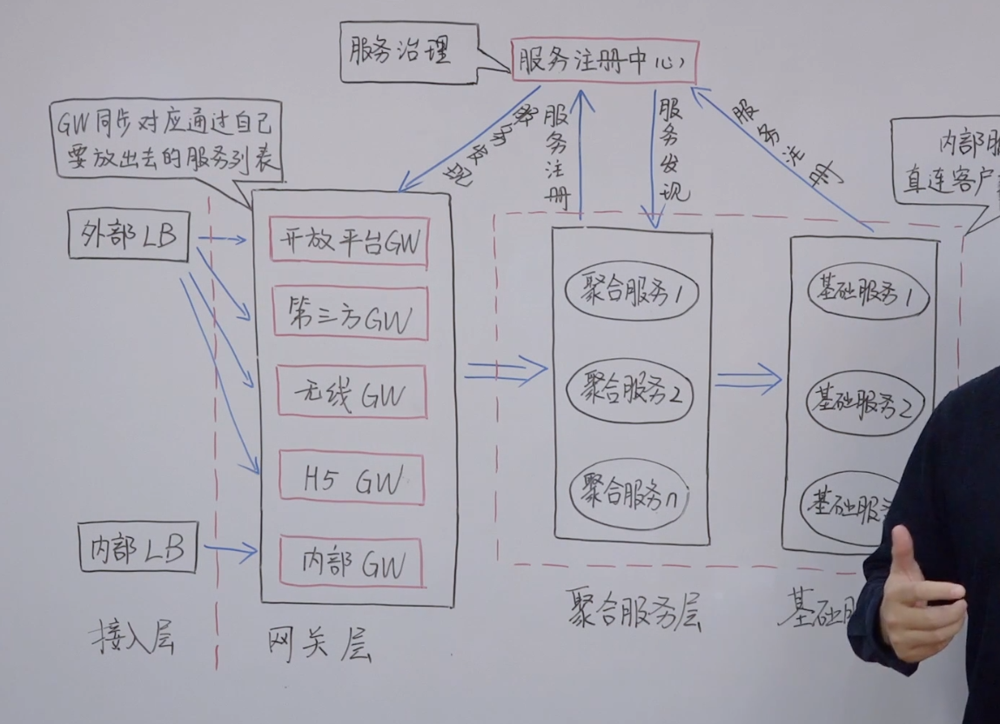

# 微服务核心架构20讲

## 01丨什么是微服务架构？

## 02丨架构师如何权衡微服务的利弊？

**利**

- 强模块化边界

- 可独立部署

- 技术多样性

**弊**

- 分布式复杂性

- 最终一致性

- 运维复杂性

- 测试复杂性

## 03丨康威法则和微服务给架构师怎样的启示？

组织架构和业务架构相匹配。

## 04丨企业应该在什么时候开始考虑引入微服务？

以单块的方式推进，慢慢演化出来，这样的微服务架构是经过业务验证的，这样再划分微服务时更加清楚。相反如果直接架设微服务，则风险较高。

## 05丨什么样的组织架构更适合微服务？

传统的团队划分，沟通成本高、反馈慢。

在一个团队的规模内端到端，微服务设计。 

## 06丨如何理解阿里巴巴提出的微服务中台战略？

中台战略。 

## 07丨如何给出一个清晰简洁的服务分层方式？

## 08丨微服务总体技术架构体系是怎样设计的？

 

## 09丨微服务最经典的三种服务发现机制

传统的LBS解析到不同的服务。LBS单点。

第二种LBS在进程类，主要在客户端。

第三种LBS进程部署在一个主机上。

**service mesh**

> A service mesh, like the open source project [Istio,](https://www.redhat.com/en/topics/microservices/what-is-istio) is a way to control how different parts of an application share data with one another. Unlike other systems for managing this communication, a service mesh is a dedicated infrastructure layer built right into an app. This visible infrastructure layer can document how well (or not) different parts of an app interact, so it becomes easier to optimize communication and avoid downtime as an app grows.
> 
> Each part of an app, called a "service," relies on other services to give users what they want. If a user of an online retail app wants to buy something, they need to know if the item is in stock. So, the service that communicates with the company's inventory database needs to communicate with the product webpage, which itself needs to communicate with the user’s online shopping cart. To add business value, this retailer might eventually build a service that gives users in-app product recommendations. This new service will communicate with a database of product tags to make recommendations, but it also needs to communicate with the same inventory database that the product page needed—it’s a lot of reusable, moving parts.
> 
> Modern applications are often broken down in this way, as a network of services each performing a specific business function. In order to execute its function, one service might need to request data from several other services. But what if some services get overloaded with requests, like the retailer’s inventory database? This is where a service mesh comes in—it routes requests from one service to the next, optimizing how all the moving parts work together.

### How can a service mesh optimize communication?

Every new service added to an app, or new instance of an existing service running in a [container](https://www.redhat.com/en/topics/containers/whats-a-linux-container), complicates the communication environment and introduces new points of possible failure. Within a complex microservices architecture, it can become nearly impossible to locate where problems have occurred without a service mesh.

That’s because a service mesh also captures every aspect of service-to-service communication as performance metrics. Over time, data made visible by the service mesh can be applied to the rules for interservice communication, resulting in more efficient and reliable service requests.

For example, If a given service fails, a service mesh can collect data on how long it took before a retry succeeded. As data on failure times for a given service aggregates, rules can be written to determine the optimal wait time before retrying that service, ensuring that the system does not become overburdened by unnecessary retries.

## 10丨微服务 API 服务网关（一）原理

## 

反向路由、认证安全、限流熔断、日志监控。

## 11丨微服务 API 服务网关（二）开源网关 Zuul

   

## 12丨跟 Netflix 学习微服务路由发现体系

Eureka 和 Zuul

## 13丨集中式配置中心的作用和原理是什么？

 

## 14丨微服务通讯方式 RPC vs REST

 

## 15丨微服务框架需要考虑哪些治理环节？

## 16丨微服务监控系统分层和监控架构

## 参考

- [Service meshes in a microservices architecture](https://cloud.google.com/architecture/service-meshes-in-microservices-architecture#:~:text=A%20service%20mesh%20is%20a,microservices%20on%20a%20chosen%20infrastructure.)

- [Google Cloud Architecture Framework: System design](https://cloud.google.com/architecture/framework/system-design)
