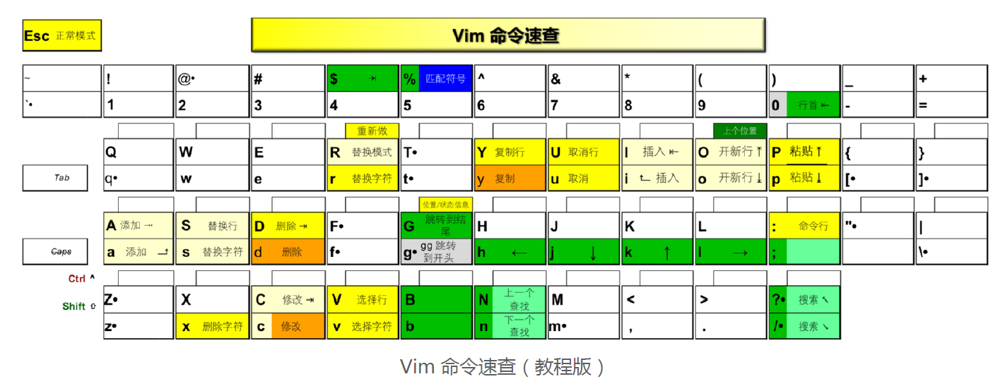

# Vim

> 笔记来自于极客时间 [Vim 实用技巧必知必会](https://time.geekbang.org/column/intro/100055801)

## 导读

想用好 Vim，先要理解 Vim 的模式转换。Vim 常用的模式有四种：

1. 普通模式：Vim 启动后的默认模式，用来移动光标、删除文本、覆盖输入文本、恢复操
   作、粘贴文本等等。
2. 插入模式：输入 i 或 a 进入插入模式，在这个模式下敲击键盘会往文字缓冲区增加文
   字，相当于普通编辑器的编辑模式。
3. 可视模式：选择文本，可以行选、块选和依次选择，选择后可以进行复制、删除、排序
   等操作。
4. 命令模式：执行内部和外部命令，通过“:”“/”“?”“:!”可以进入命令模式，分别
   对应的是：执行内部命令、向上或向下搜索、执行外部命令。

## 开篇词｜我们为什么要学 Vim？

> 我特别喜欢 Larry Wall（拉里 · 沃尔）所说的程序员的三大美德： 懒惰，急切，傲慢
> （laziness, impatience, hubris）

第一，与 vi 最初只运行在 Unix 平台上不同，**Vim 是一个完全跨平台的编辑器**。

第二，**Vim 也是一个高度可定制、可扩展的编辑器**。

第三，作为一个发展了几十年的老牌开源软件，**Vim 也有着良好的生态环境**。

> 有一颗勇于探索的心，愿意花点力气把手里的“武器”打造得更为好用、称心。

### 01｜各平台下的 Vim 安装方法：上路前准备好你的宝马

**Red Hat 和 CentOS 系列**

`yum list installed | grep vim`

此时，我建议使用 `sudo yum install vim-X11` 来安装图形界面的 Vim，或至少使用
`sudo yum install vim-enhanced` 来安装增强版本的 Vim（如果你不在这台机器上
进行图形界面登录的话）。

**Debian 和 Ubuntu 系列**

> 如果你使用标准的 GNOME 桌面环境的话（大部分的情况），安装 vim-gtk3 或 vimgnome。
> 如果你使用 KDE 桌面的话，安装 vim-gtk。
> 如果你只使用文本界面的话，安装 vim-nox。

`apt list --installed | grep vim`

**手工编译**

```shell
./configure --enable-pythoninterp \
--enable-python3interp \
--enable-gui=auto
make -j
sudo make install
```

**macOS 下的安装**

如果你希望使用图形界面，则需要自行安装 MacVim，一个跟现代 macOS 融合较好的独立 Vim 版本。

在安装了 Homebrew 之后，一般情况下，你需要修改你的 .bash_profile（如果使用 Bash
的话）、.zprofile（如果使用 Zsh 的话）或是相应的 shell 的配置文件，调整 PATH，把
/usr/local/bin 放到 /usr/bin 前面。我个人在 .bash_profile 里是这样配置的：

```shell
if [[ $PATH != "$HOME/bin"* ]]; then
PATH=~/bin:/usr/local/bin:/usr/local/sbin:`echo $PATH|sed -e "s!:$HOME/bin!!
fi
```

如果你这样配置的话，那只要执行 brew install macvim，然后在等待安装完成之后，
你用 vim 启动的就是 MacVim 了。跟 Homebrew 里的其他软件一样，你以后要升级 MacVim 的话，只需要输入命令 brew upgrade macvim 即可。

### 02｜基本概念和基础命令：应对简单的编辑任务

> 一个键最多有三排内容：最底下是直接按键的结果，中间是按下 Shift 的结果
> （变大写），上面偏右的小字是按下 Ctrl 的结果。我们还用了一些特殊符号来表示操作的位置，如果你已经了解了这些命令的功能，你也自然就明白它们的意义了。



“:q!”：退出 Vim
“:wq”：存盘退出
“:s”：执行替换
“:!”：执行外部命令
“:edit”（一般缩写为 “:e”）：编辑文件
“:w”：写文件
“:r”：读文件
“:help”：查看帮助 

把撤销文件放在用户个人的特定目录下，既保证了安全，又免去了其他目录下出现不必要文件的麻烦。要达到这个目的，我在 Linux/macOS 下会这么写：

```shell
set nobackup
set undodir=~/.vim/undodir
```

```
if !isdirectory(&undodir)
    call mkdir(&undodir, 'p', 0700)
endifif
```

Mac 系统实时显示键位操作软件：[KeyCastr](https://github.com/keycastr/keycastr)


### 03｜更多常用命令：应对稍复杂的编辑任务

这些选择动作的基本附加键是 a 和 i。其中，a 可以简单理解为英文单词 a，表示选定后
续动作要求的完整内容，而 i 可理解为英文单词 inner，代表后续动作要求的内容的“内
部”

`c2i{`


**行内查找重复**

有时候我们想要在当前行内查找一个字符，我们可以通过`f{char}/t{char}`来从当前位置开始到行尾进行查找，也可以通过`F{char}/T{char}`从当前位置开始到行首进行查找。简单的说就是小写向后找，大写向前找。

> ```shell
> ;                       Repeat latest f, t, F or T [count] times. See cpo-;
> 
>                                                         ,
> ,                       Repeat latest f, t, F or T in opposite direction
>                         [count] times. See also cpo-;
> ```


## 参考

- [How do I exit Vim?](https://stackoverflow.com/questions/11828270/how-do-i-exit-vim)
- [Vim技巧之重复](https://blog.csdn.net/ii1245712564/article/details/46496347)
